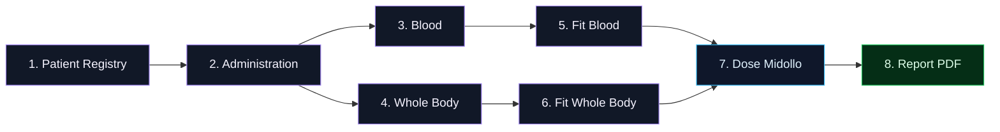
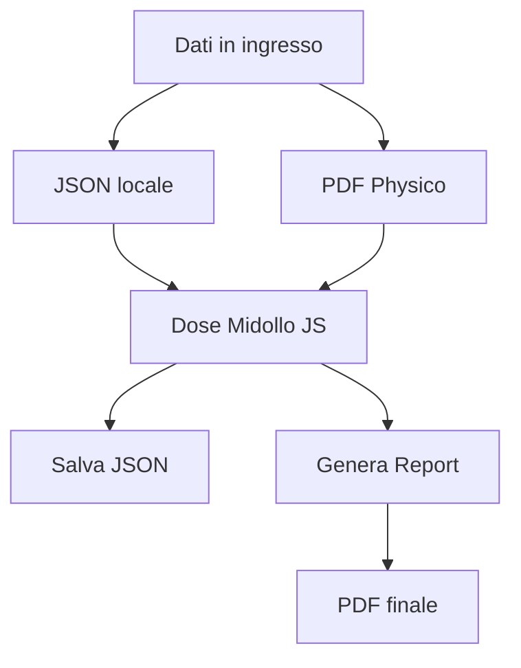
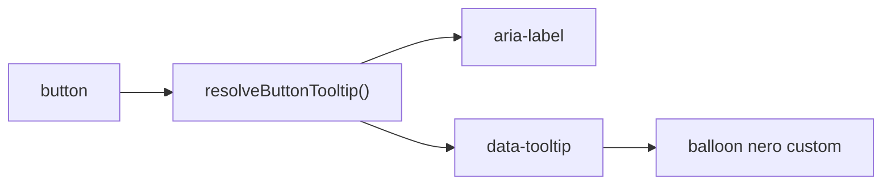
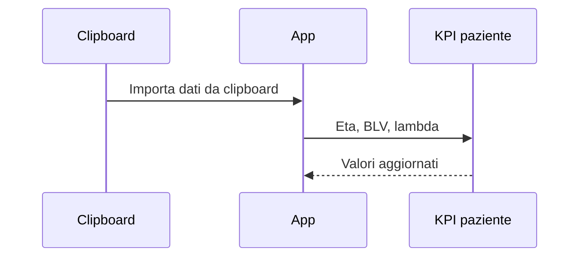
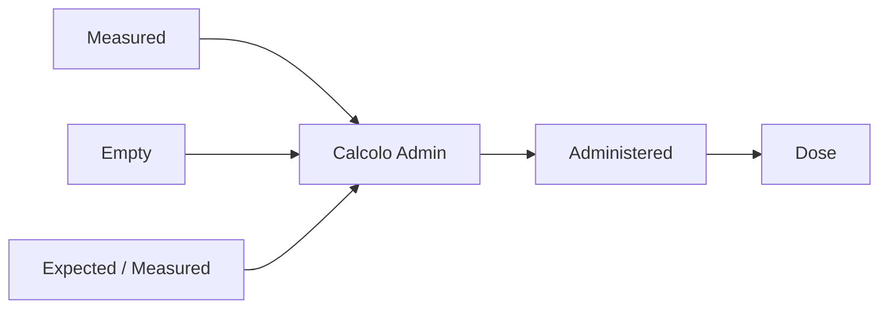
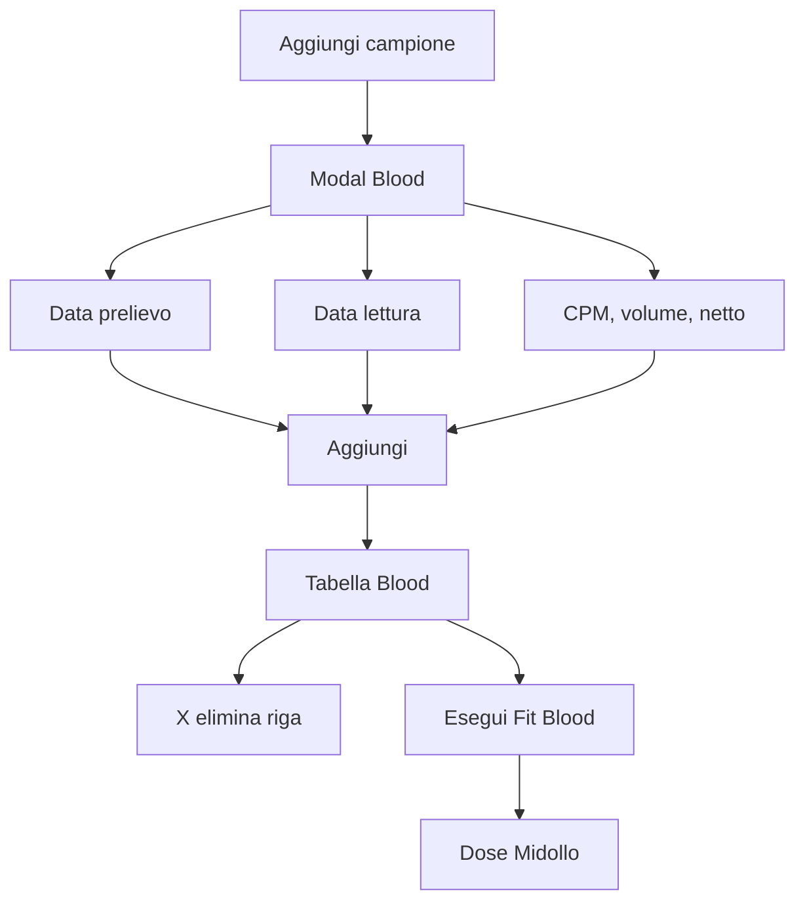
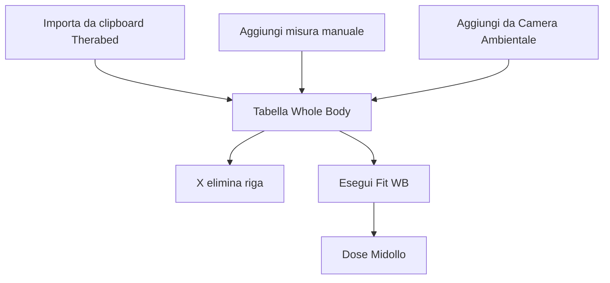
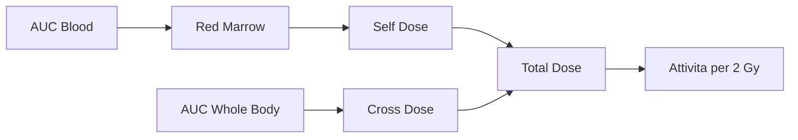
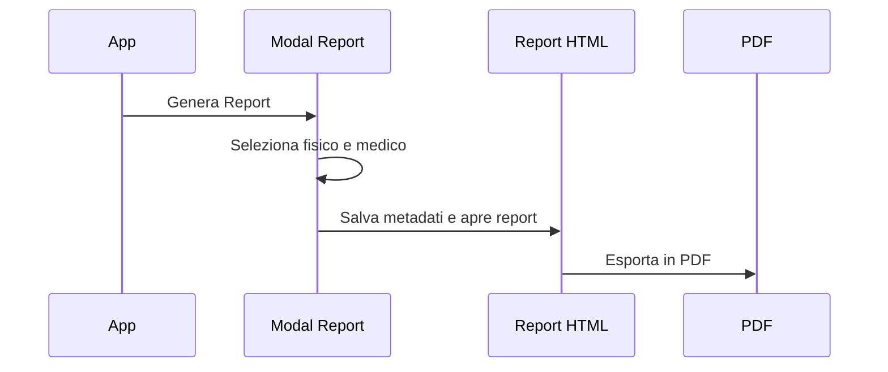
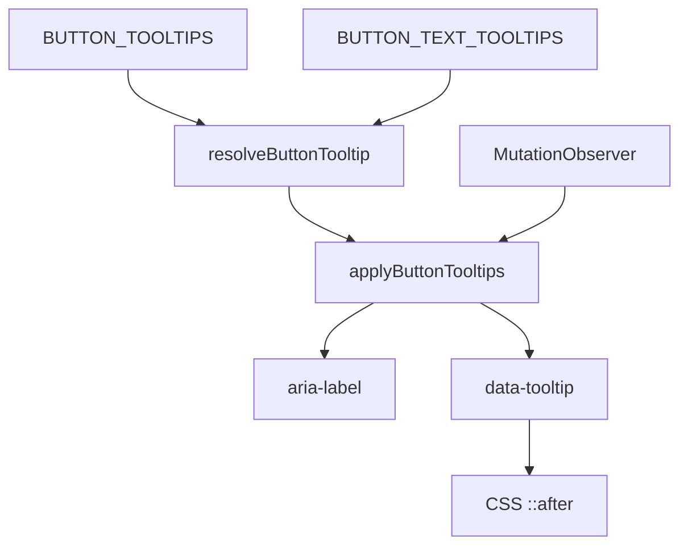

# Dose Midollo JS

> Guida operativa illustrata per usare l'app, capire il flusso dei calcoli e riconoscere al volo il significato dei pulsanti.

---

## Mission Control

L'app lavora come una sequenza di moduli: prima si definiscono paziente e somministrazione, poi si caricano Blood e Whole Body, infine si fanno fit, dose e report.

---

## Plancia Comandi

| Pulsante | Tooltip | Quando usarlo |
| --- | --- | --- |
| Importa da PDF | Importa automaticamente i dati paziente e terapia da un PDF Physico. | Quando parti da un documento gia pronto. |
| Carica JSON | Carica una sessione salvata in formato JSON. | Per riprendere un lavoro precedente. |
| Salva JSON | Scarica su file JSON tutti i dati inseriti e calcolati. | Prima di chiudere o archiviare il caso. |
| Reset | Cancella i dati locali e riporta l'app allo stato iniziale. | Quando vuoi ripartire da zero. |
| Genera Report | Apre la scelta di fisico e medico prima di generare il report. | A fine workflow. |

---

## Tooltip: una sola voce, non due

Il tooltip nero e quello voluto: e il tooltip custom dell'app.
Il vecchio balloon giallo era il tooltip nativo del browser generato da `title`, ora rimosso.

I pulsanti dinamici, come le X di cancellazione nelle tabelle, vengono intercettati anche quando la tabella viene ridisegnata.

---

## Patient Registry

Qui entrano i dati anagrafici, peso, altezza, radiofarmaco e parametri di decadimento. Il pulsante di import da clipboard serve a saltare l'inserimento manuale quando i dati sono gia copiati da una sorgente esterna.

---

## Administration

La sezione Administration e il motore temporale del caso: definisce attivita, residuo e data/ora di riferimento per Blood e Whole Body.

---

## Blood Bay

| Comando Blood | Effetto |
| --- | --- |
| Aggiungi campione | Apre la finestra di inserimento. |
| Aggiungi | Valida i campi e aggiunge il campione alla tabella. |
| Svuota tabella | Cancella tutti i campioni Blood. |
| X | Elimina una singola riga. |
| Esegui Fit Blood | Stima la curva Blood e aggiorna i risultati. |

---

## Whole Body Deck

| Comando Whole Body | Effetto |
| --- | --- |
| Importa da clipboard | Legge le righe MISURA copiate da Therabed. |
| Aggiungi misura Whole Body | Inserisce una misura manuale da lettura cartacea. |
| Aggiungi misura da Camera Ambientale | Calcola il rapporto tra due letture ambientali. |
| Svuota | Cancella tutte le misure Whole Body. |
| Esegui Fit WB | Stima la curva Whole Body. |

---

## Dose Engine

La dose finale nasce dalla combinazione di contributi self e cross. I KPI restano visibili nella sezione Dose Midollo, mentre il report prende i valori salvati nello stato dell'app.

---

## Report Launch

Il report finale eredita dati paziente, risultati dosimetrici, grafici e firme. Anche il pulsante di esportazione mantiene `aria-label`, cosi resta accessibile senza evocare il tooltip giallo del browser.

---

## Checklist Pre-Flight

- Dati paziente compilati.
- Data/ora di somministrazione presente.
- Attivita somministrata coerente.
- Campioni Blood ordinati e plausibili.
- Misure Whole Body presenti e successive alla somministrazione.
- Fit Blood eseguito.
- Fit Whole Body eseguito.
- Dose Midollo aggiornata.
- Report generato con fisico e medico corretti.
- JSON salvato per archivio o revisione.

---

## Mappa file

| File | Ruolo |
| --- | --- |
| `DoseMidollo.html` | Interfaccia principale dell'app. |
| `src/script.js` | Logica applicativa, calcoli, tooltip e rendering dinamico. |
| `src/style.css` | Stile dell'app e balloon nero dei tooltip. |
| `report.html` | Pagina report esportabile. |
| `report/report.js` | Popolamento del report e grafici. |
| `GUIDA_TOOLTIP_E_WORKFLOW.md` | Questa guida. |

---

## Nota tecnica sui tooltip

La logica dei tooltip e centralizzata in `src/script.js`:

Questo permette di coprire sia i pulsanti statici sia quelli creati dopo, come le righe cancellabili delle tabelle.
